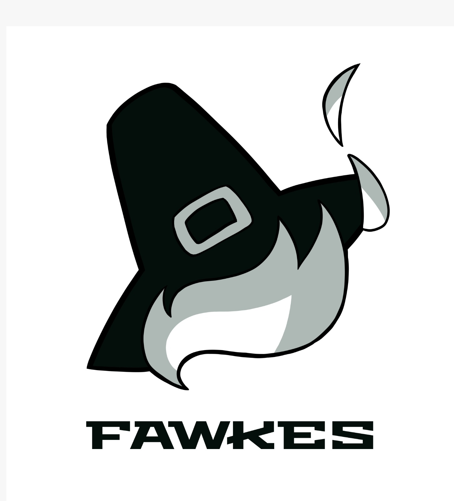

  
  <h2 align="center">Fawkes</h2>

  | <a href="#desafio">Desafio</a> |
  <a href="#solucao">Solução</a> |
  <a href="#backlog">Backlog do Produto</a> |
  <a href="#dor">DoR</a> |
  <a href="#dod">DoD</a> |
  <a href="#sprints">Sprints</a> |
  <a href="#tecnologias">Tecnologias</a> |
  <a href="#como-executar">Como Executar</a> |
  <a href="#equipe">Equipe</a> |

> **Parceiro:** Newe Log &nbsp;·&nbsp; **Curso:** 2º ADS &nbsp;·&nbsp; **Período:** 2026-1
>
> **Status do Projeto:** Em andamento 🔄

---

## 🏭 Desafio 

A **Newe Log** enfrenta um processo de compras manual, descentralizado e sujeito a falhas: pedidos sem rastreabilidade, aprovações sem registro formal e estoque sem visibilidade em tempo real. O resultado é compras não autorizadas, retrabalho e dificuldade de auditoria.

O desafio é construir uma ferramenta que organize, governe e dê transparência a todo o ciclo de aquisições — do pedido ao recebimento da mercadoria.

---

## 💡 Solução 

O **Sistema (nome)** é uma aplicação desktop desenvolvida em Java com JavaFX, voltada à gestão completa do processo de compras da Newe Log.

A solução contempla abertura de pedidos com numeração automática, fluxo de aprovação com parecer registrado, controle de estoque com alertas de nível mínimo, módulo de cotações com comparativo entre fornecedores, registro de recebimento com anexo de nota fiscal e dashboard gerencial com indicadores financeiros e operacionais.

O objetivo é padronizar o processo, eliminar compras não autorizadas e gerar dados estratégicos para tomada de decisão e auditorias futuras.

---

## 📋 Backlog do Produto 

[Backlog Do Produto](./docs/product-backlog.md)

---

## ✅ DoR — Definition of Ready 

[DOR](./docs/dor.md)

---

## 🏆 DoD — Definition of Done 
[DOR](./docs/dod.md)

---

## 📅 Sprints 

| Sprint | Período | Meta | Documentação |
|--------|:-------:|------|:------------:|
| 🏃🏻 **Sprint 1** | 16/03 – 05/04 | Login, Funcionários, Fornecedores, Estoque (cadastro) | [Docs](./docs/sprints/sprint-1/backlog.md) |
| 🏃🏻 **Sprint 2** | 13/04 – 03/05 | Pedidos de compra, Aprovação, Movimentação de estoque | [Docs](./docs/sprints/sprint-2/backlog.md) |
| 🏃🏻 **Sprint 3** | 11/05 – 31/05 | Cotações, Dashboard, Histórico, Recebimento | [Docs](./docs/sprints/sprint-3/backlog.md) |

---

## 💻 Tecnologias 

  
  
  
  
  
  

---

## 🚀 Como Executar 

### Pré-requisitos

- [Java 17+](https://adoptium.net/)
- [JavaFX SDK 17+](https://openjfx.io/)
- [MySQL 8+](https://dev.mysql.com/downloads/)
- [Git](https://git-scm.com/)

Consulte o [Manual de Instalação](./docs/manual-instalacao.md) para prosseguir com a instalação.

---

## 👥 Equipe 

  <table>
    <tr>
      <th>Membro</th>
      <th>Função</th>
      <th>GitHub</th>
      <th>LinkedIn</th>
    </tr>
    <tr>
      <td>Thiago Nascimento</td>
      <td>Product Owner</td>
      <td></td>
      <td></td>
    </tr>
    <tr>
      <td>Marcos Alexandre</td>
      <td>Scrum Master</td>
      <td></td>
      <td></td>
    </tr>
    <tr>
      <td>Tais Fernandes</td>
      <td>Desenvolvedora</td>
      <td></td>
      <td></td>
    </tr>
    <tr>
      <td>Mateus Fernandes</td>
      <td>Desenvolvedor</td>
      <td></td>
      <td></td>
    </tr>
    <tr>
      <td>João Conrado</td>
      <td>Desenvolvedor</td>
      <td></td>
      <td></td>
    </tr>
    <tr>
      <td>João Barreto</td>
      <td>Desenvolvedor</td>
      <td></td>
      <td></td>
    </tr>
    <tr>
      <td>Vitor Bomfim</td>
      <td>Desenvolvedor</td>
      <td></td>
      <td></td>
    </tr>
    <tr>
      <td>Gabriel Campos</td>
      <td>Desenvolvedor</td>
      <td></td>
      <td></td>
    </tr>
    <tr>
      <td>Adler Rocha</td>
      <td>Desenvolvedor</td>
      <td></td>
      <td></td>
    </tr>
  </table>

---

Fawkes · 2º ADS · Fatec SJC · 2026-1
